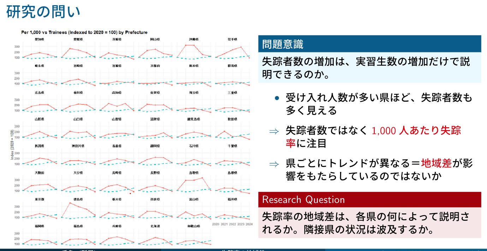
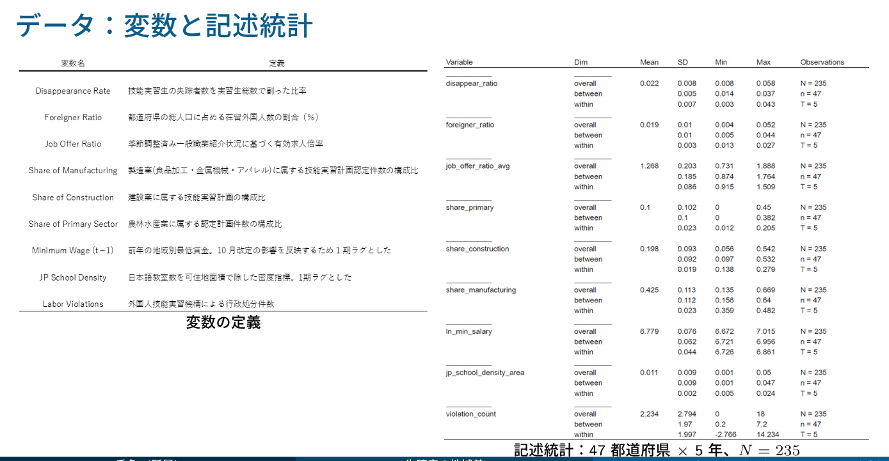
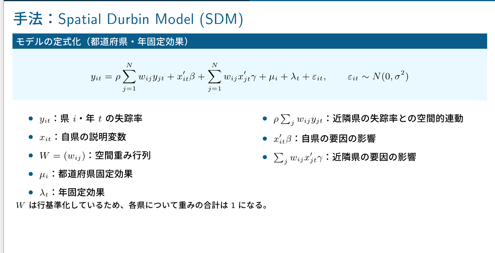
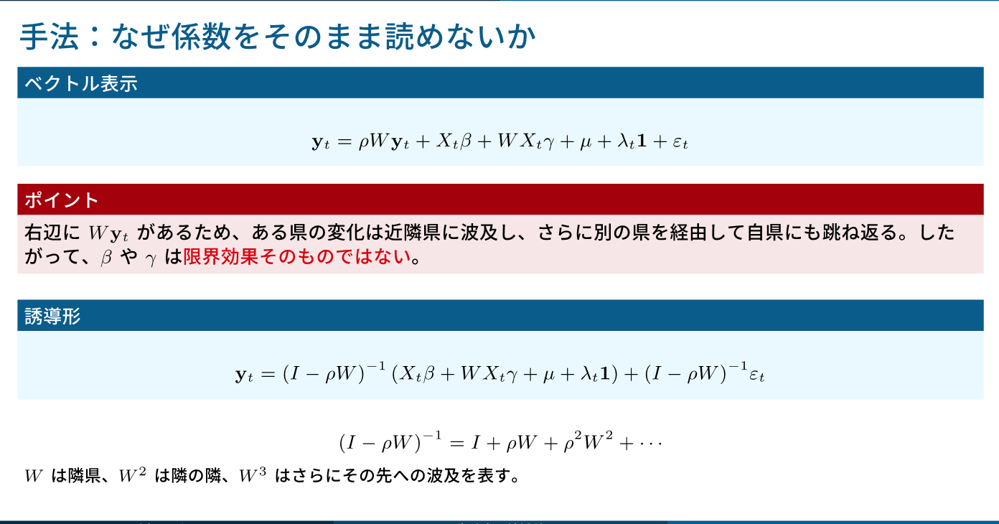
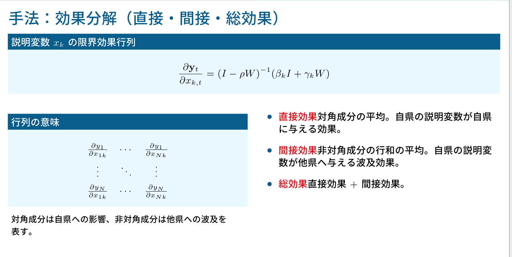
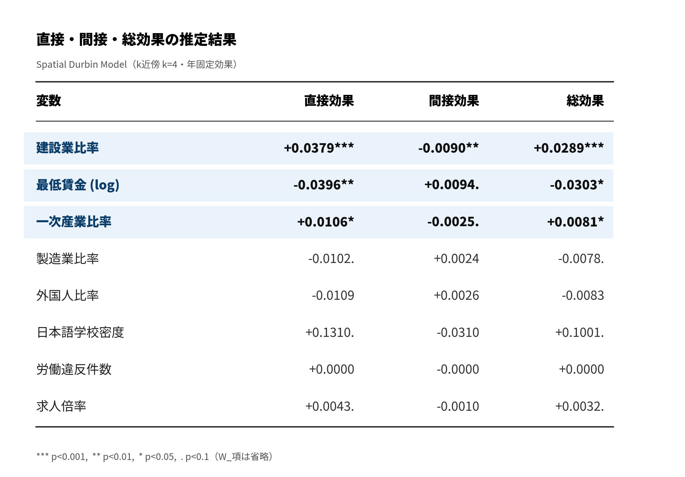

# 技能実習生の失踪率と地域差の空間分析

技能実習生の失踪率の都道府県差を、五省庁の公開データでパネル化し、空間ダービンモデル（Spatial Durbin Model, SDM）で分析した。**建設業比率と最低賃金が頑健に効き、外国人比率そのものは失踪率を説明しない**ことを示した。波及効果は限定的で、要因は各県内でおおむね完結する。

因果効果の識別を主張するものではなく、公開データから問いを立て、パネルを構築し、空間モデルで地域差を分解した探索的分析として整理している。

## 問題意識

失踪者数の増加は、技能実習生数の増加だけで説明できるのか。受け入れ人数が多い県ほど失踪者数も多く見えるが、それは規模の効果かもしれない。そこで失踪者数そのものではなく、**技能実習生1,000人あたりの失踪率**に注目し、都道府県ごとの地域差を見た。



県ごとにトレンドが異なる。人数の多さだけでは見えない地域差が存在する。これを何が説明するのかが本分析の問いである。

## データ

47都道府県 × 5年（N = 235）のパネルデータを構築した。失踪率と地域変数を、五省庁の公開統計から統合している。空間分析では都道府県庁所在地の緯度経度（`data/Citylatlongi.xlsx`）を用いた。

主な変数は、技能実習生1,000人あたり失踪率、有効求人倍率、外国人比率、産業構成（建設業・製造業・一次産業の比率）、最低賃金（対数）、日本語学校密度、労働違反件数。変数定義と公開上の注意は [data/README.md](data/README.md) を参照。



`between`／`within` 分解により、地域間の差と地域内の年変動を確認した。失踪率の変動は地域間（between）の差が大きく、地域差に注目する妥当性を裏づける。

なお違反件数は、実際の違反の多さだけでなく、監督・検査・通報・公表のされやすさにも左右される。労働環境の悪さとして単純には解釈できない変数である点に注意している。

## 手法：空間ダービンモデル

隣接県との関係を見るため、空間重み行列を構築し、Moran's I で空間自己相関を確認したうえで SDM を推定した。固定効果は**年固定効果のみ**を入れ、都道府県固定効果は入れていない。地域差そのものを吸収してしまうためである（全国共通の年変動だけを除き、県間の差は残す）。

空間重み行列の定義によって近隣の扱いが変わるため、k近傍（k=4）とクイーン型隣接の2通りを比較した。







クイーン型では沖縄・北海道などの離島県が陸続きの隣接を持たず孤立する。この扱いをどう設計するかが、空間波及効果の検出に影響する（後述）。

## 結果：直接・間接・総効果

SDM の係数は空間ラグ（λ）を通したフィードバックを含むため、そのままでは解釈できない。直接効果（自県内）・間接効果（隣県への波及）・総効果に分解して読む。以下は k近傍（k=4）・年固定効果の推定結果である。



読み取れることは次の通り。

- **建設業比率**：直接効果が最も強い正（p < 0.001）。建設業が集積する県ほど失踪率が高い。間接効果はほぼゼロで、効果は自県内で完結する。
- **最低賃金（対数）**：直接効果が負（p < 0.01）。賃金が高い県ほど失踪率が低い。逃亡の機会費用として解釈と整合する。
- **一次産業比率**：直接効果が弱い正（p < 0.05）。
- **外国人比率・製造業比率・求人倍率・日本語学校密度・労働違反件数**：いずれも有意でない。とくに**自県の外国人比率は失踪率を説明しない**。「外国人が多いから失踪が多い」という素朴な見方を、データは支持しない。

空間自己回帰係数 λ は負で有意であり、失踪率は隣接県と逆方向に動く（代替的な空間構造）。ただし間接効果の大半は非有意で、県をまたぐ波及は限定的である。

要するに、失踪率を駆動するのは**自県の産業構造（建設・一次）と賃金**であって、外国人の量ではない。効果は各県内でおおむね完結する。これは通常のパネルでは出せず、SDM の効果分解によって初めて切り分けられた点である。

## 改善の方向：空間重み行列の再設計

上記は卒業研究の本仕様（k近傍 k=4）の結果である。改善案として、陸続きの隣接関係を表すクイーン型隣接でも推定した。建設業比率と最低賃金の効果は両定義で安定して現れた一方、外国人比率と労働違反の波及効果は重みの定義に依存して変化した。

空間波及の検出は、離島県をどう近隣として扱うか（島嶼ブリッジ処理を含む）に左右される。重み行列の設計を詰めることが、今後の課題である。

## 限界

- **都道府県単位データの限界**：企業・監理団体・市区町村・職場・個人の違いを捉えられない。同一県内でも受け入れ先や支援体制は大きく異なる。
- **違反件数の観測バイアス**：監督・検査・通報・公表のされやすさを含むため、労働環境の悪さとして単純に解釈できない。
- **空間重み行列への依存**：近隣の定義（k近傍・距離・隣接）によって Moran's I や SDM の結果が変わりうる。
- **識別の弱さ**：固定効果・空間モデルを用いても因果効果を識別できるわけではない。失踪率・労働市場・産業構成・違反・外国人比率は相互に関連し、観測されない要因も残る。

因果効果の証明、特定の政策効果の主張、隣接県の影響の明確な確認は、本分析の範囲外である。


```


