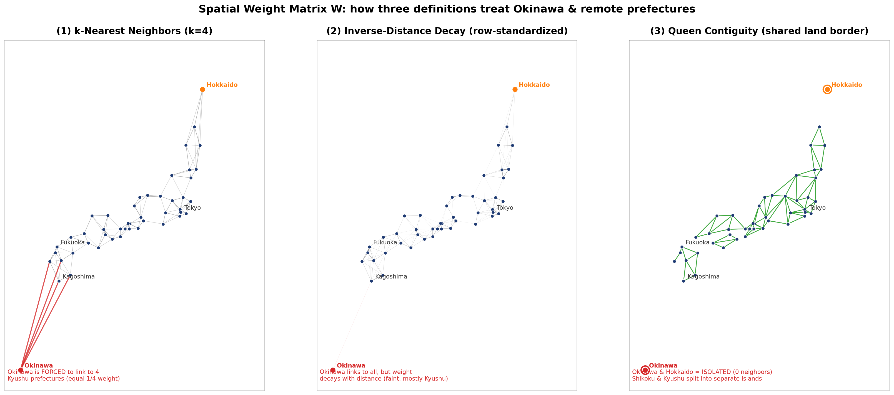

# Spatial Analysis of Technical Intern Trainee Disappearances in Japan

## Overview

This repository is a research portfolio project on prefecture-level variation in the disappearance rate of Technical Intern Trainees in Japan. The analysis uses a 2020-2024 panel dataset for 47 prefectures and examines how disappearance rates are associated with local labor market conditions, industrial composition, foreign resident share, Japanese-language classroom density, labor-related violation counts, and neighboring prefecture characteristics.

The project is exploratory. It estimates statistical associations and spatial patterns; it does not claim to identify or prove causal effects.

## Research Question

How are prefecture-level disappearance rates of Technical Intern Trainees associated with local socioeconomic conditions, observed labor-related violations, Japanese-language learning environments, and spatially neighboring prefectures?

More specifically, the analysis asks whether disappearance rates are systematically related to:

- labor demand, measured by the average job-offer ratio;
- foreign resident share;
- industrial composition, including primary industry, construction, and manufacturing shares;
- minimum wages;
- Japanese-language classroom density;
- observed labor-related violation counts;
- spatially lagged characteristics of nearby prefectures.

## Data

The main analysis dataset is `data/final.xlsx`, a prefecture-year panel covering 47 prefectures from 2020 to 2024. Spatial coordinates are provided in `data/Citylatlongi.xlsx`, which contains prefectural capital latitude and longitude information used to construct spatial weights.

The public repository intentionally contains only aggregated analysis inputs. Private working files and draft documents are excluded from version control. In particular, `docs/*.docx` and `data/geocoding.xlsx` should not be restored to the public repository.

Key variables include:

- `disappear_ratio`: disappearance rate among Technical Intern Trainees;
- `disappear_per1000`: disappearances per 1,000 trainees;
- `trainees_total` and `disappeared`: trainee counts and disappearance counts;
- `job_offer_ratio_avg`: average job-offer ratio;
- `foreigner_ratio`: foreign resident share;
- `share_primary`, `share_construction`, `share_manufacturing`: industrial composition measures;
- `min_salary`: prefectural minimum wage;
- `jp_school_num` and `jp_school_density_area`: Japanese-language classroom availability;
- `violation_count`: observed labor-related violation count.

See `data/README.md` for variable definitions, data notes, and publication cautions.

## Methods

The empirical workflow combines panel regression and spatial exploratory analysis:

- pooled OLS models;
- prefecture fixed effects;
- year fixed effects;
- two-way fixed effects;
- prefecture-clustered robust standard errors;
- k-nearest-neighbor spatial weights based on prefectural capital coordinates;
- Moran's I tests for spatial autocorrelation in disappearance rates and model residuals;
- exploratory Spatial Durbin Model estimation to compare associations with own-prefecture and neighboring-prefecture covariates.

The fixed effects and spatial models help describe robust patterns in the panel data, but they do not eliminate all sources of confounding or endogeneity. Coefficients should therefore be interpreted as conditional associations, not causal effects.

## Repository Structure

```text
data/
  final.xlsx              # Public prefecture-year analysis dataset
  Citylatlongi.xlsx       # Prefectural capital coordinates for spatial weights
  README.md               # Data documentation and publication notes

figures/
  W_comparison_japan_citygeo.png

results/
  .gitkeep                # Generated tables and model outputs are written here

src/
  00_paths.R
  01_prepare_analysis_data.R
  02_regression_models.R
  03_output_tables.R
  04_spatial_weights_and_moran.R
  05_spatial_durbin_model.R
  06_fixed_effect_market_access_optional.R
  final.R                 # Main public analysis entry point

paper/
  .gitkeep

docs/
  .gitkeep                # Draft Word documents are intentionally ignored
```

## Main Figure

The figure below compares spatial weight definitions constructed from prefectural capital coordinates.



## Limitations

This project has several important limitations:

- Endogeneity: labor market conditions, enforcement intensity, employer behavior, trainee placement, and local institutional factors may be jointly determined with disappearance rates.
- Dependence on the definition of `W`: spatial results depend on how the spatial weights matrix is defined, including the choice of k-nearest neighbors, distance measures, and row standardization.
- Prefecture-level aggregation: the analysis cannot capture municipality-level, firm-level, workplace-level, or individual-level heterogeneity.
- Observation bias in violation counts: `violation_count` reflects observed, inspected, reported, or published violations. It may also capture differences in monitoring and disclosure intensity, not only the underlying incidence of violations.
- Limited causal identification: fixed effects, clustered standard errors, and spatial controls improve descriptive adjustment, but they do not by themselves identify causal effects.

## Reproducibility

Run the analysis from the repository root in R:

```r
source("src/final.R")
```

The public entry point runs the core data preparation, panel regression, output table, and Moran's I scripts. The Spatial Durbin Model can be run separately:

```r
source("src/05_spatial_durbin_model.R")
```

Required R packages include:

```r
install.packages(c(
  "readxl", "dplyr", "tibble",
  "estimatr", "car", "fixest", "modelsummary", "gt", "webshot2",
  "geosphere", "spdep", "splm", "maps", "mapdata",
  "ggplot2", "ggrepel"
))
```

Generated files are written to `results/` and `figures/`. Private working files, raw data, draft Word documents, and geocoding workbooks are intentionally excluded from the public repository.

## Future Work

Future extensions could improve the analysis by:

- testing alternative spatial weight matrices and reporting sensitivity to `W`;
- incorporating municipality-level or firm-level data where legally and ethically publishable;
- separating violation observation intensity from underlying labor conditions;
- expanding source documentation and formal data provenance checks;
- comparing results across alternative outcome definitions, such as disappearances per 1,000 trainees;
- developing a stronger research design if a credible source of exogenous variation becomes available.
