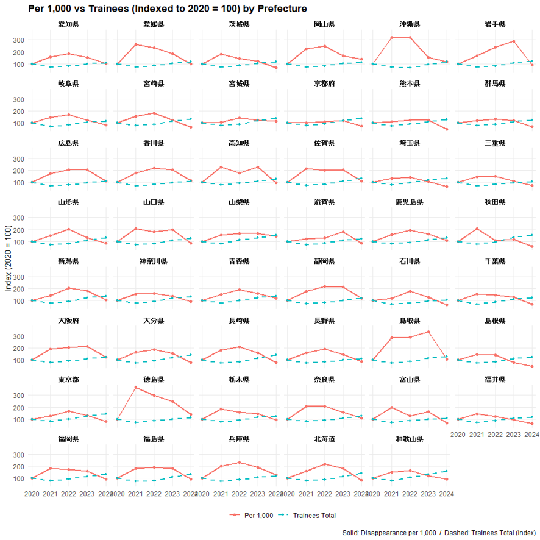
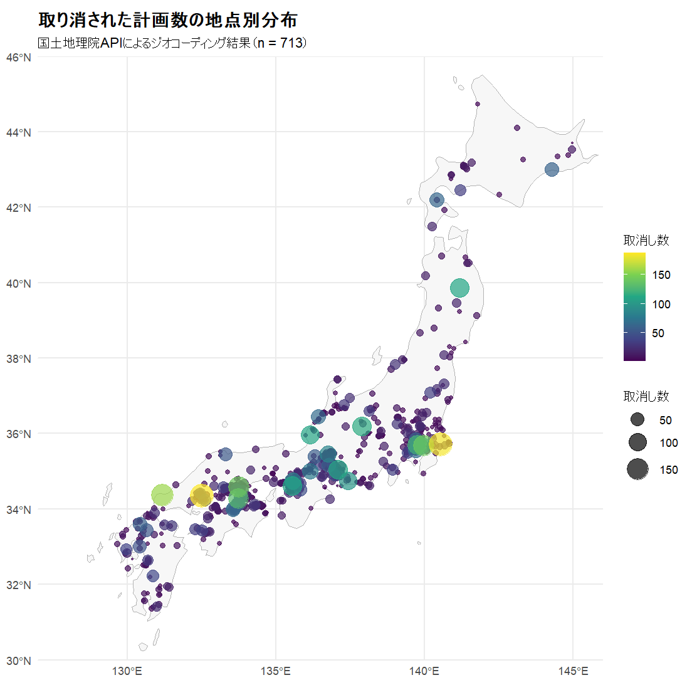
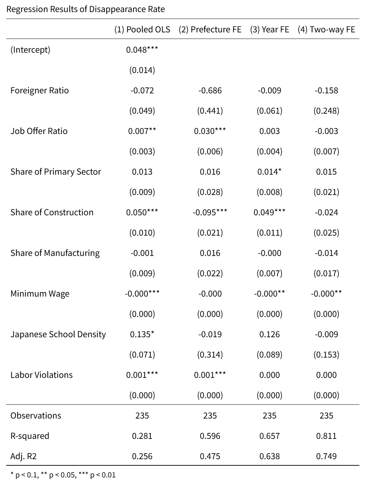

# 技能実習生の失踪率と地域差に関する探索的分析

このリポジトリは、技能実習生の失踪者数について、都道府県別・年別データを作成し、地域差と空間的な関係を探索した研究プロセス型のポートフォリオです。

出発点は、技能実習生の失踪者数の増加が、技能実習生数そのものの増加だけで説明できるのか、という問題意識でした。人数だけを見ると、受け入れ人数が多い地域ほど失踪者数も多く見えます。そこで本分析では、失踪者数そのものではなく、技能実習生1,000人あたりの失踪者数や、都道府県ごとの地域差に注目しました。

この分析は、因果関係を証明するものではありません。結果は強い結論を出せるものではなく、明確な政策効果を示したものでもありません。むしろ、問題意識からデータを作り、モデルを試し、結果が弱かったことも含めて、どこに限界があるのかを確認した過程として整理しています。

## 問題意識

最初に確認したかったのは、失踪者数の増加が単に技能実習生数の増加に比例しているだけなのか、それとも地域によって失踪率に違いがあるのかという点です。

そのため、都道府県別に次のような見方をしました。

- 技能実習生数の規模
- 失踪者数
- 技能実習生1,000人あたりの失踪者数
- 都道府県ごとの違反件数や地域的な分布

### 出発点を示す図

技能実習生数と失踪率を比較し、人数の多さだけでは見えにくい地域差を確認しました。



## 作成したデータ

分析では、`data/final.xlsx` を中心に、都道府県別・年別のパネルデータを作成しました。対象は47都道府県で、年別に失踪率や地域変数を整理しています。

空間分析では、都道府県庁所在地の緯度経度データとして `data/Citylatlongi.xlsx` も使用しました。

整理した主な変数は次の通りです。

- 技能実習生数
- 失踪者数
- 技能実習生1,000人あたりの失踪者数
- 有効求人倍率
- 外国人比率
- 産業構成
- 最低賃金
- 日本語教室数や密度
- 労働関係の違反件数

変数の定義や公開上の注意点は、[data/README.md](data/README.md) にまとめています。

## 地域差と違反件数の確認

次に、都道府県ごとの違いや違反件数の分布を確認しました。ここでは、どの地域で失踪率や違反件数が高く見えるのかを、地図や散布図で確認することを目的にしました。

ただし、違反件数は「実際に違反が多い地域」をそのまま表すとは限りません。監督や検査が入りやすい地域、通報や公表がされやすい地域では、観測される違反件数が多くなる可能性があります。そのため、この変数は労働環境の悪さだけでなく、観測されやすさも含んでいる可能性があります。



## 回帰分析と固定効果モデル

地域差をもう少し整理するために、回帰分析と固定効果モデルを試しました。

固定効果モデルを使った理由は、都道府県ごとに変わりにくい特徴を一定程度取り除き、同じ都道府県の中で年によってどう変わるかを見たかったためです。また、年ごとの全国的な変化も考慮するために、年固定効果も試しました。

試した主なモデルは次の通りです。

- 通常の回帰モデル
- 都道府県固定効果モデル
- 年固定効果モデル
- 都道府県固定効果と年固定効果を入れたモデル

結果として、いくつかの変数には関係がありそうに見える部分もありましたが、強い結論を出せるほど安定した結果ではありませんでした。特に、都道府県固定効果と年固定効果を入れると、都道府県間の違いで説明されていた変数は識別しにくくなります。外国人比率、産業構成、日本語教室密度などは、短期間では大きく変化しにくいため、係数の解釈には注意が必要です。



## 空間分析

さらに、隣接県との関係を見るために、空間分析にも取り組みました。

具体的には、都道府県どうしの近さや隣接関係を表す空間重み行列を作成し、Moran's I や Spatial Durbin Model を試しました。これは、自県の状況だけでなく、隣接県や近い県の状況も関係している可能性を確認するためです。

ただし、空間分析の結果は、空間重み行列をどう定義するかに依存します。隣接県で見るのか、距離で見るのか、k近傍で見るのかによって結果が変わる可能性があります。そのため、ここでも強い因果的な主張はしていません。

### k-nearest neighbors network

都道府県庁所在地の座標を使い、各都道府県を近い県と結ぶネットワークを作成しました。


### queen contiguity network

都道府県境界の接触関係をもとに、クイーン型の隣接ネットワークも作成しました。


### W comparison

空間重み行列の定義によって、どの県が近隣として扱われるかが変わることを比較しました。


## 結果の受け止め方

この分析では、技能実習生の失踪率と地域変数の関係を探索しました。しかし、結果は強くありませんでした。

回帰分析では、変数によって関係がありそうに見える部分はありましたが、固定効果の入れ方やモデルの設定によって解釈が変わります。空間分析でも、空間的な関係を検討することはできましたが、隣接県の要因が自県に明確に波及しているとまでは言えません。

そのため、このREADMEでは次のような主張はしません。

- ある要因が失踪を引き起こした
- 特定の政策効果を証明した
- 隣接県の影響を明確に確認した

言えることは、都道府県単位の公開データを使って、失踪率の地域差を整理し、固定効果モデルや空間モデルを試したが、因果関係を主張できるほどの結果は得られなかった、ということです。

## 限界

この分析には、特に次の限界があります。

### 都道府県単位データの限界

都道府県単位の集計データでは、企業、監理団体、市区町村、職場、個人の違いを捉えることができません。同じ都道府県内でも、受け入れ先や産業、支援体制は大きく異なる可能性があります。

### 違反件数の観測バイアス

違反件数は、実際の違反の多さだけでなく、監督、検査、通報、公表のされやすさにも左右されます。そのため、違反件数を労働環境の悪さとして単純に解釈することはできません。

### 空間重み行列への依存

空間分析の結果は、どの県を近隣とみなすかに依存します。k近傍、距離、隣接関係のどれを使うかによって、Moran's I や Spatial Durbin Model の結果が変わる可能性があります。

### 識別の弱さ

固定効果モデルや空間モデルを使っても、因果関係を識別できるわけではありません。失踪率、労働市場、産業構成、違反件数、外国人比率などは互いに関連しており、観測できない要因も多く残っています。

## その他の補助的な可視化

研究過程では、READMEに掲載したPNG画像のほかに、補助的なHTML出力も作成しました。

- [回帰結果のHTML出力](figures/idfzjcq3pthk2ahpahpqmd.html)

このHTMLは画像ではありませんが、研究過程で作成した補助的な可視化・出力として残しています。

## リポジトリ構成

```text
data/
  final.xlsx              # 都道府県別・年別の分析データ
  Citylatlongi.xlsx       # 都道府県庁所在地の緯度経度
  README.md               # データ定義と公開上の注意

figures/
  pref_compare.png
  vioration_gis.png
  regression.png
  japan_knn_k4_network.png
  japan_queen_network.png
  W_comparison_japan_citygeo.png
  idfzjcq3pthk2ahpahpqmd.html

results/
  analysis_tables.rtf
  regression_results.csv
  moran_*.csv
  sdm_*.txt / sdm_*.csv
  W_*.csv

src/
  final.R                 # 分析を再実行するRスクリプト
```

`docs/*.docx` や `data/geocoding.xlsx` など、公開に向かない作業ファイルは公開用の成果物として復元しない前提です。

## 再現方法

Rでリポジトリのルートから次を実行します。

```r
source("src/final.R")
```

このスクリプトでは、データの読み込み、記述統計、回帰分析、固定効果モデル、空間重み行列、Moran's I、Spatial Durbin Model、結果表の出力をまとめて実行します。

必要な主なRパッケージは次の通りです。

```r
install.packages(c(
  "readxl", "dplyr",
  "estimatr", "car", "fixest",
  "geosphere", "spdep", "splm", "sf", "maps", "mapdata",
  "ggplot2", "ggrepel"
))
```

## このポートフォリオで示したいこと

他大学や理系分野の高度な分析と比べると、モデルの厳密さやデータの粒度には見劣りする部分があります。特に、因果推論としては弱く、都道府県単位の短いパネルデータだけで強い結論を出すことはできません。

それでも、この分析では、問題意識から出発し、公開データを整理し、失踪者数ではなく失踪率に注目し、固定効果モデルや空間分析を試しました。そして、結果が強くなかったことや、モデルの限界を隠さず確認しました。

このREADMEは、完成された強い結論を示すためではなく、研究の進め方、試行錯誤、限界の認識を示すためのポートフォリオとして位置づけています。
